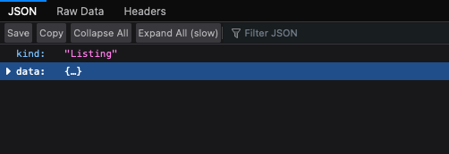
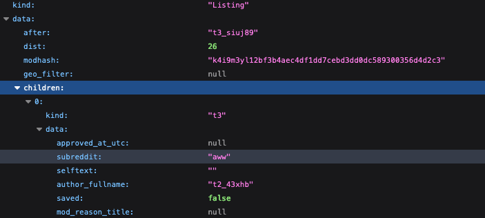

# Who Is The Ahole?

Reddit maintains an open, JSON based, API for all of its posts, comments, and other things too. Additionally, they are friendly with bots and rate limiting, which makes it a great resource for practicing making web requests, and using APIs. As a result, some of their subreddits even have rules which are designed to make bots easier to design and use. One example is the subreddit "/r/AmITheAsshole".

In this forum users submit their personal stories of interpersonal conflict and ask the internet to judge them. Stories range from surprisingly wholesome to shockingly horrible. Users are asked to vote via comment, and the possible votes are...

* YTA: "You're The Asshole"
* NTA: "Not The Asshole"
* ESH: "Everyone Sucks Here"
* NAH: "No Assholes Here"

If users wish to make a judgement, they are asked to use one (and only one) of these acronyms (in all caps) in their comment.

In this exercise we're going to capitalize on these rules to make a script that:

* Fetches the current day's top posts from AITA
* For the top posts of the day, read the comments searching for votes.
* Tally the votes to determine the internet's judgment!

## Additional Details And Notes:

### Completion Criteria

Your program should be able to do the following:

1. Fetch today's top posts from /r/AmITheAsshole.
2. For each of the posts returned (default number is 25 by the way).
    * Extract the URL of the post itself
    * Use that URL to fetch the top comments
    * Read the comments and tally the votes
3. For all the fetched posts, report in the terminal the vote counts.

**Note that** by default Reddit only sends the full text of the first ~65 comments, and provides information that would allow you to fetch the remaining comments if you wish. Consider the exercise complete if you can parse just the comments returned by default. If you'd like, you can try to fetch ALL the comments and parse them as well, but you should consider that to be bonus work.

## Bonus, Make It Harder:

Save each individual judgement vote summary to a file. Devise a scheme for naming the files and ensure a specific folder exists (or create one) to hold each new file. 

### Helpful Resources

Reddit provides this data in a textual format called JavaScript Object Format (JSON). This format is ubiquitous on the web for a variety of reasons. Although we use built in tools to parse this JSON formatted data into a deeply nested Python dictionary, you may still want to read this [overview of using the JSON format in Python](https://realpython.com/python-json/).

Reddit's JSON format is "well structured" which means it always follows a consistent set of rules. Many of these rules are documented on [Reddit's API documentation](https://www.reddit.com/dev/api) with additional information about the JSON structure on this [Reddit Wiki page](https://github.com/reddit-archive/reddit/wiki/JSON).

This data can be fetched from any subreddit by adding .json to the end of the usual URL. For example, for the current top 20 posts on /r/awww in json simply go to [https://www.reddit.com/r/AmItheAsshole.json](https://www.reddit.com/r/AmItheAsshole.json).

It can be extremely helpful to look at this data in program designed to navigate JSON. Firefox has an excellent JSON navigator built in, so if you open the JSON URL in Firefox you'll see something like this:

If you click on one of the arrows next to a field whose data is also a collection (either a dictionary or list) it will expand.

This popular Chrome extension provides similar functionality in Chrome [https://chrome.google.com/webstore/detail/json-viewer/gbmdgpbipfallnflgajpaliibnhdgobh](https://chrome.google.com/webstore/detail/json-viewer/gbmdgpbipfallnflgajpaliibnhdgobh). 

If you don't want to install Firefox or this Chrome extension, this online tool provides similar functionality: [https://codebeautify.org/jsonviewer](https://codebeautify.org/jsonviewer).

### Rate Limiting

Reddit does rate limit bot requests. Make sure you specify a User-Agent header because Reddit will significantly increase the amount of requests you can make in a given unit time if you include a User-Agent.

Additionally, you may want to start by only processing the comments of the top 1 posts. Once that code works, expand to more posts. This way you'll reduce your chance of getting rate limited while your code still has significant errors.